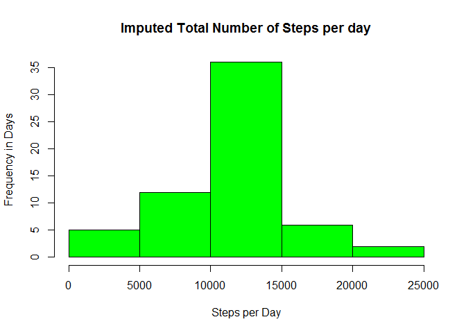

# Reproducible Research: Peer Assessment 1

This single R markdown document is created as part of the Peer Assignment 1 for 
processing by **knitr** and then transformed into an HTML file

## Loading (preprocessing) the data
The Github repo contains the dataset for the assignment. But the script will
download if necessary.

```r
f <- "activity.zip"

## unzip downloaded file if necessary
if (!"activity.csv" %in% dir()) { 
  unzip(f) 
}

activity <- read.csv("activity.csv")
```

## Loading any necessary libraries
Only one additional library is required. Lattice will be loaded for graphics
functions.

```r
library(lattice)
```


## What is mean total number of steps taken per day?
1. Calculate the sum of steps per day excluding NA's

```r
##aggregrate (sum) the activity table

allstepsperday <- aggregate(steps~date, activity, FUN = sum, na.rm=TRUE)

##display example of data
head(allstepsperday)
```

```
##         date steps
## 1 2012-10-02   126
## 2 2012-10-03 11352
## 3 2012-10-04 12116
## 4 2012-10-05 13294
## 5 2012-10-06 15420
## 6 2012-10-07 11015
```


2. Make a histogram of the total number of steps taken each day

```r
##create a histogram of the aggregated data

hist(allstepsperday$steps, col="blue", main="Total Number of Steps per day"
     , xlab="Steps per Day", ylab = "Frequency in Days")
```

<!-- -->

3. Calculate and report the mean and median of the total number of steps taken 
per day

```r
##calculate the mean and median including NA's
meansteps <- format(mean(allstepsperday$steps), scientific=FALSE)
mediansteps <- median(allstepsperday$steps)
```
###Total mean number of steps taken per day is 10766.19.
###Total median number of steps taken per day is 10765.


## What is the average daily activity pattern?
1. Make a time series plot (i.e. type = "l") of the 5-minute interval (x-axis) 
and the average number of steps taken, averaged across all days (y-axis)

```r
##aggregate the average number of steps per interval
stepsperinterval<-aggregate(steps~interval, data=activity, FUN = mean, na.rm=TRUE)

##plot the time series using the plot function with type = 'l'
plot(steps~interval,data = stepsperinterval,type="l", 
    main="Average number of steps per 5min interval", xlab="5 minute Interval", 
      ylab = "Average number of steps")
```

<!-- -->

2. Which 5-minute interval, on average across all the days in the dataset, 
contains the maximum number of steps?


```r
##use the which.max function to retrieve highest value
maxsteps <- stepsperinterval[which.max(stepsperinterval$steps),]$interval
```
###The 5-minute interval that contains the maximum number of steps is 835.

## Imputing missing values

1. Calculate and report the total number of missing values in the dataset 
(i.e. the total number of rows with NAs)


```r
##calculate the total number of missing values using is.na
missingvalues <- sum(is.na(activity$steps))
```
###The total number of rows with NA's 2304.

2. Devise a strategy for filling in all of the missing values in the dataset. 
The strategy does not need to be sophisticated.

###We will populate the missing values in the dataset with the mean of that 
###interval across all days. 

3. Create a new dataset that is equal to the original dataset but with the 
missing data filled in.


```r
##go through each observation during creation and insert the mean interval value 
##from all days for any NAs

activitynona <- transform(activity, steps = ifelse(is.na(activity$steps),
                         stepsperinterval$steps[match(activity$interval,
                         stepsperinterval$interval)], 
                         activity$steps))
```

4. Make a histogram of the total number of steps taken each day and Calculate 
and report the mean and median total number of steps taken per day. Do these 
values differ from the estimates from the first part of the assignment? What is 
the impact of imputing missing data on the estimates of the total daily number 
of steps?


```r
allstepsperdaynona <- aggregate(steps~date, activitynona, FUN = sum)
hist(allstepsperdaynona$steps, col="green", 
     main="Imputed Total Number of Steps per day"
     , xlab="Steps per Day", ylab = "Frequency in Days")
```

<!-- -->


```r
meanstepsnona <- format(mean(allstepsperdaynona$steps), scientific = FALSE)
medianstepsnona <- format(median(allstepsperdaynona$steps), scientific = FALSE)
```
###Total mean number of steps taken per day with imputed values is 10766.19.
###Total median number of steps taken per with imputed values is 10766.19.

The mean steps did not change at all which is expected based on the strategy to 
impute values. The median did increase slightly by a total of 1 bringing both
mean and median values closer together (if rounded).

## Are there differences in activity patterns between weekdays and weekends?
1. Create a new factor variable in the dataset with two levels - "weekday" and 
"weekend" indicating whether a given date is a weekday or weekend day.

```r
##convert column to useable date format
activitynona$date <- as.Date(strptime(activitynona$date, format="%Y-%m-%d"))
##assign days of the week values to new column day
activitynona$day <- weekdays(activitynona$date)

##overwrite actual values of day with "weekday" or "weekend"

for (i in 1:nrow(activitynona)) {
    if (activitynona[i,]$day %in% c("Saturday","Sunday")) {
        activitynona[i,]$day<-"weekend"
    }
    else{
        activitynona[i,]$day<-"weekday"
    }
}
```

2. Make a panel plot containing a time series plot (i.e. type = "l") of the 
5-minute interval (x-axis) and the average number of steps taken, averaged 
across all weekday days or weekend days (y-axis)


```r
##aggregate steps by day for plotting
stepsbyday <- aggregate(activitynona$steps ~ activitynona$interval + 
                          activitynona$day, activitynona, mean)

names(stepsbyday) <- c("interval", "day", "steps")

xyplot(steps ~ interval | day, stepsbyday, type = "l", layout = c(1, 2), 
    xlab = "Interval", ylab = "Number of steps")
```

<!-- -->

